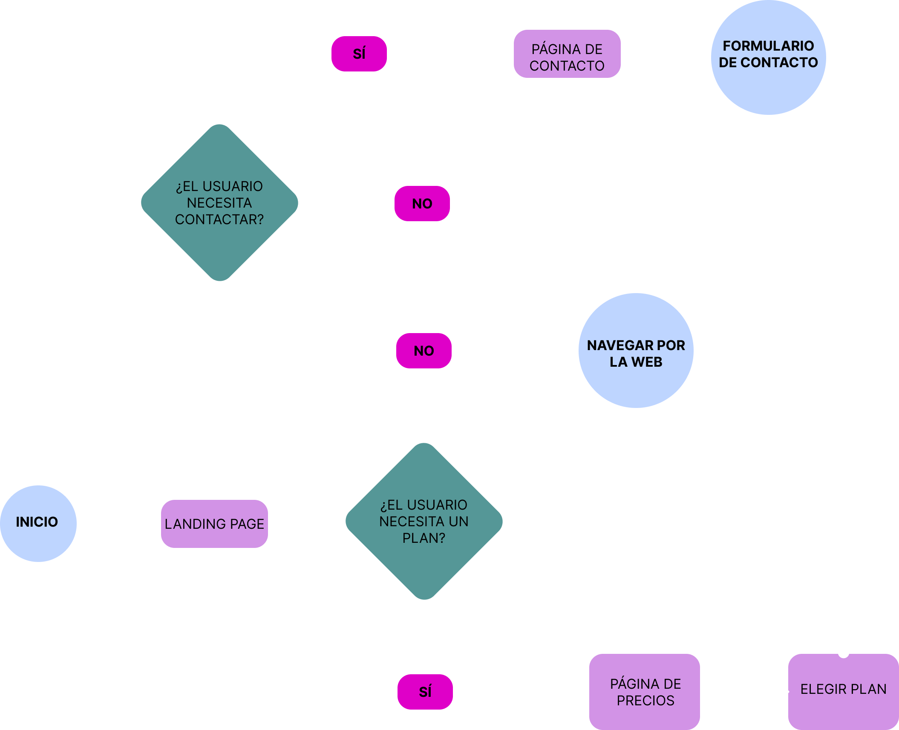

# 🎬 Cinephile — Plataforma de Streaming (Proyecto Frontend)


Proyecto desarrollado por Johanna, Nira y Aïda como parte de nuestro trabajo colaborativo de Factoría F5.

Construido con React, Vite y Sass, siguiendo buenas prácticas de arquitectura, accesibilidad y diseño.

## 🎨 Descripción del proyecto
Cinephile es una interfaz de suscripción para una plataforma de streaming ficticia.
Incluye:
- Landing page
- Página de precios con tres planes: Basic, Superior y Premium
- Página de contacto con un formulario
- Cards dinámicas con estilos diferenciados
- Diseño responsive
- Componentes reutilizables
- Arquitectura Sass modular
- Uso de variables, mixins y estructura limpia
- Animaciones y microinteracciones

## 🚀 Tecnologías utilizadas

- **React** — Librería para construir interfaces de usuario basadas en componentes.
- **Vite** — Bundler ultrarrápido para desarrollo moderno.
- **Sass** — Preprocesador CSS para estilos modulares, escalables y mantenibles.

## 🛠️ Herramientas de trabajo
- **Trello** — Organización del flujo de trabajo y tareas.
- **GitHub** — Control de versiones y repositorio del proyecto.
- **Visual Studio Code** — Editor principal de desarrollo.
- **Figma** — Diseño de la interfaz, prototipado y guía visual.


## 📁 Estructura del proyecto
```
src/
│── components/
│   ├── priceCard/
│   ├── button/
│── pages/
│   ├── prices/
│── style/
│   ├── _variables.scss
│   ├── _globals.scss
│   ├── main.scss
│── App.jsx
│── main.jsx
```

## 🧭 User Flow del proyecto
A continuación se muestra el User Flow diseñado para Cinephile, donde se representa el recorrido del usuario a través de las principales pantallas: Landing Page → Pricing → Contact.



El User Flow nos permitió definir:
- La navegación principal
- La jerarquía de pantallas
- Los puntos de interacción clave
- La estructura del contenido
- La experiencia general del usuario

## ⚙️ Instalación y ejecución
```
npm install
```
```
npm run dev
```

## 🤝 Autoras

- [**Johanna**](https://github.com/Johamonroy20): Scrum Master y Developer
- [**Nira**](https://github.com/nmantilla12): Developer
- [**Aïda**](https://github.com/AidaG91): Product Owner y Developer